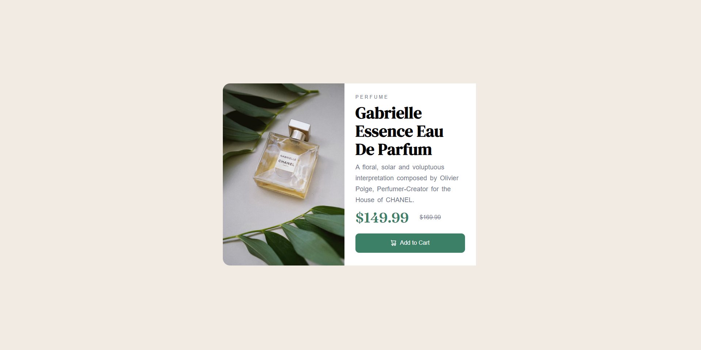

# Frontend Mentor - Product preview card component solution

This is a solution to the [Product preview card component challenge on Frontend Mentor](https://www.frontendmentor.io/challenges/product-preview-card-component-GO7UmttRfa). Frontend Mentor challenges help you improve your coding skills by building realistic projects. 

## Table of contents

- [Overview](#overview)
  - [The challenge](#the-challenge)
  - [Screenshot](#screenshot)
  - [Links](#links)
- [My process](#my-process)
  - [Built with](#built-with)
  - [What I learned](#what-i-learned)
  - [Continued development](#continued-development)
  - [Useful resources](#useful-resources)
- [Author](#author)

**Note: Delete this note and update the table of contents based on what sections you keep.**

## Overview

### The challenge

Users should be able to:

- View the optimal layout depending on their device's screen size
- See hover and focus states for interactive elements

### Screenshot

### Links

- Solution URL: [Add solution URL here](https://your-solution-url.com)
- Live Site URL: [Add live site URL here](https://your-live-site-url.com)

## My process

First of all make a container with full size of your browser screen and align the main content box in the center of your web page by using "grid".

Secondly divide the main content box into two sections by using flex. In the first section add the background image ("product-desktop-view") and in the second section add the contents and add the necessary styles.

Third use @media query to change the style in the mobile view and main content to be display block then change the image ("product-mobile-view") for the first section and adjust the image size.

At last adjust the styles as necessary

### Built with

- Semantic HTML5 markup
- CSS custom properties
- Flexbox
- CSS Grid
- Mobile-first workflow

### What I learned

I learned to properly place the elements both in mobile view and web view as well as to adjust the elements according to the screen width.

Selecting the colors are also quite different if I want to make my own and font styles to attract the user.

### Continued development

I want to continue focusing on the development of my skill with the help of Front-end Mentor and I hope to complete all the project and gain alot of knowledge to succeed in my career.

### Useful resources

- [Useful resource 1](https://www.w3schools.com) - This helped me to learn display property along with other related content and how you can manipulate block level elements. I really liked this and will use it going forward.

## Author

- Frontend Mentor - [@Akhil-Banothu](https://www.frontendmentor.io/profile/Akhil-Banothu)

